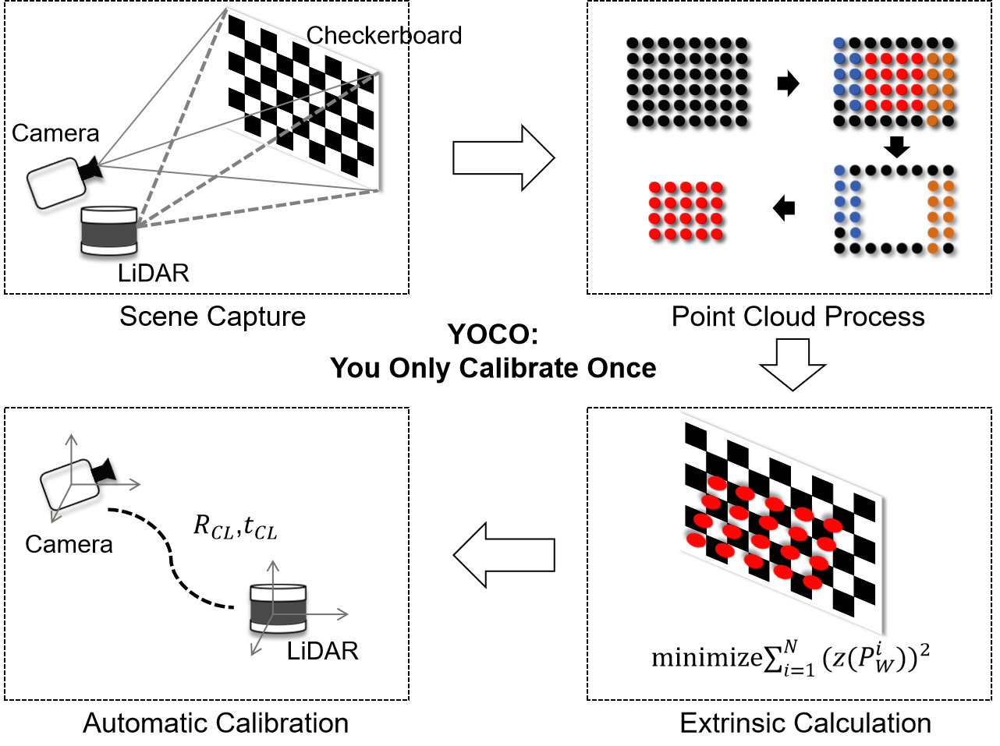

# YOCO Repository

Hello everyone,

Welcome to the YOCO repository! Please note that there are several previous versions available here, some of which still have some issues. We kindly ask you not to refer to them at the moment. We are currently working diligently on organizing the latest version of the code (removing some strange definitions and redundant Chinese comments), and it is expected to be released soon. Once our paper is accepted, we will also provide the link here.

Thank you for your understanding and patience!

Best regards,
[YOCO Team](https://github.com/louiszengCN/lidar_camera_auto_calibration)

